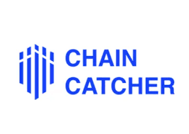

# ByteDance trains a 10-trillion-parameter AI model, aiming for global leadership. | KuCoin

---
title: ByteDance trains a 10-trillion-parameter AI model, aiming for global leadership. | KuCoin
url: https://www.kucoin.com/news/flash/bytedance-training-10-trillion-parameter-ai-model-aiming-for-global-leadership
hostname: kucoin.com
description: ChainCatcher report, according to the Financial Times, as Chinese companies continue to close the gap with top U.S. AI labs, ByteDance is training an AI model w
sitename: ByteDance trains a 10-trillion-parameter AI model, aiming for global leadership.
date: "2026-08-07"
tags: ['Crypto Exchange,Cryptocurrency Exchange,Bitcoin Exchange']
---
ChainCatcher report, according to the Financial Times, as Chinese companies continue to close the gap with top U.S. AI labs, ByteDance is training an AI model whose scale may approach Anthropic’s advanced Mythos system. According to three informed sources, the Chinese tech giant is currently in the early stages of training a super-large model with an estimated parameter count reaching the 10-trillion level—approximately three times that of China’s currently largest released model, Kimi K3 under Moonshot AI. One of the sources said ByteDance’s model is currently undergoing pre-training, a phase that typically takes three to six months; if all goes well, it will then proceed to fine-tuning and eventual release. The exact scale of the model will be finalized later. Anthropic has not disclosed the parameter counts of its models, but industry estimates suggest its most advanced Mythos 5 model has around 8 trillion parameters, while Fable 5 is estimated at about 5 trillion. It should be noted that while parameter count determines a model’s foundational capacity or memory ceiling, the actual performance of a model also depends on other factors, including data quality and training methodology.

# ByteDance trains a 10-trillion-parameter AI model, aiming for global leadership.

 Chaincatcher

Share

ByteDance is training a 10-trillion-parameter AI model aimed at competing with Anthropic’s Mythos system. The model is in early pre-training and is expected to require three to six months before fine-tuning and release. Anthropic’s Mythos 5 is estimated at 8 trillion parameters, while Fable 5 has approximately 5 trillion. The final scale has not yet been finalized. AI and crypto news continues to highlight major tech companies expanding into advanced AI. Global crypto policy remains a key factor in how these models may integrate with blockchain ecosystems.

Source:

Disclaimer: The information on this page may have been obtained from third parties and does not necessarily reflect the views or opinions of KuCoin. This content is provided for general informational purposes only, without any representation or warranty of any kind, nor shall it be construed as financial or investment advice. KuCoin shall not be liable for any errors or omissions, or for any outcomes resulting from the use of this information.
Investments in digital assets can be risky. Please carefully evaluate the risks of a product and your risk tolerance based on your own financial circumstances. For more information, please refer to our [Show original](https://www.chaincatcher.com/article/2281234)
[Terms of Use](https://www.kucoin.com/legal/terms-of-use)and

[Risk Disclosure](https://www.kucoin.com/legal/risk-disclosure-statement).
