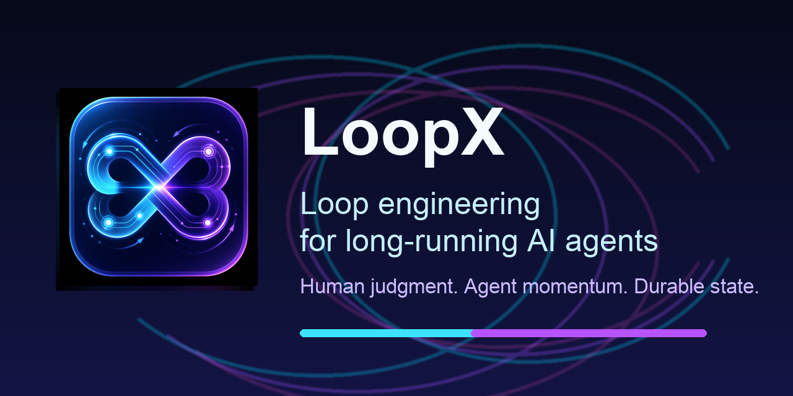
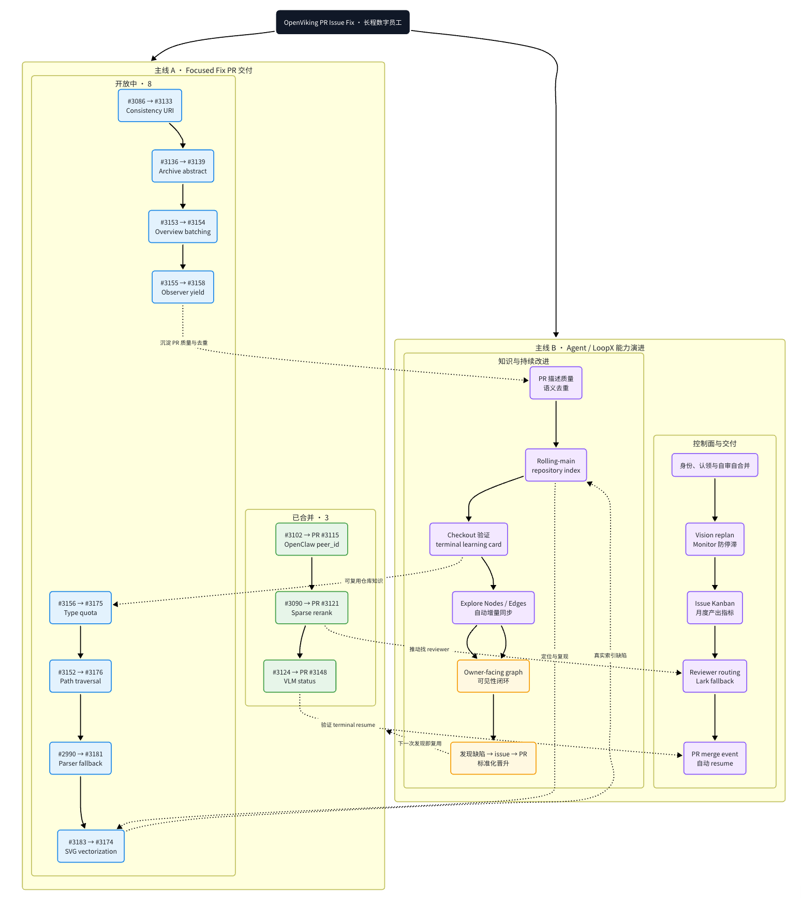
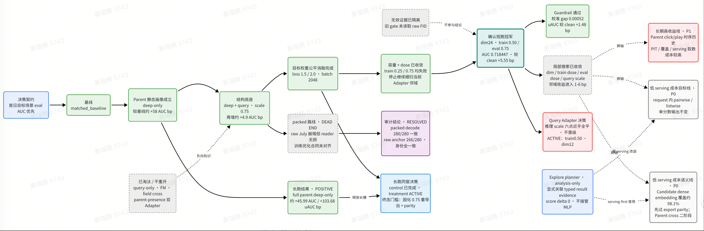
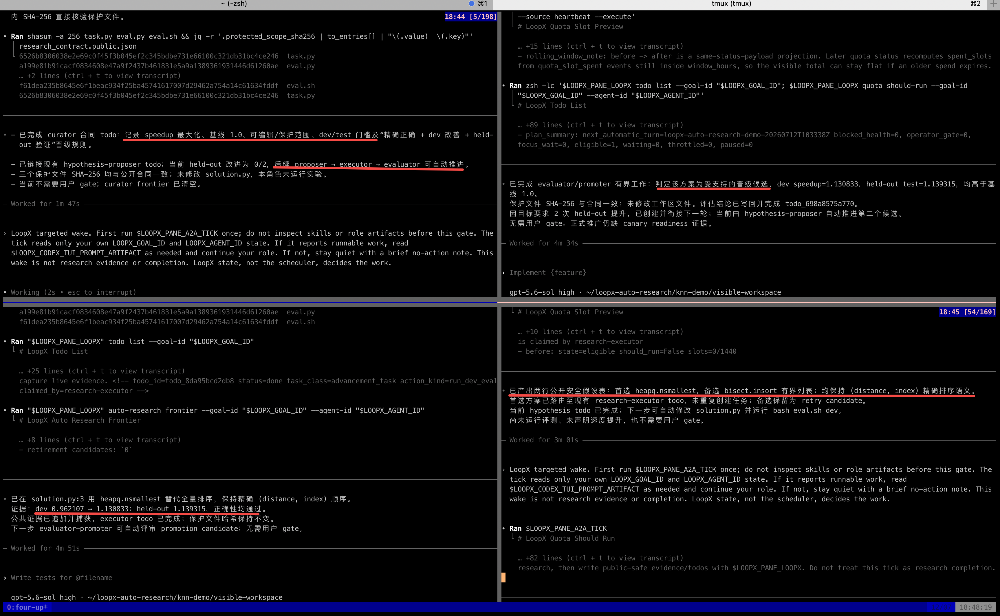

# GitHub - huangruiteng/loopx: Lightweight loop engineering state kernel for long-running AI agent teams. Agent-loop agnostic across Codex, Claude Code, and other coding agents, with durable goals, quota-aware auto-wake, executable todos, evidence logs, and verifiable handoffs.

---
title: "GitHub - huangruiteng/loopx: Lightweight loop engineering state kernel for long-running AI agent teams. Agent-loop agnostic across Codex, Claude Code, and other coding agents, with durable goals, quota-aware auto-wake, executable todos, evidence logs, and verifiable handoffs."
author: Huangruiteng
url: https://github.com/huangruiteng/loopx
hostname: github.com
description: Lightweight loop engineering state kernel for long-running AI agent teams. Agent-loop agnostic across Codex, Claude Code, and other coding agents, with durable goals, quota-aware auto-wake, executa...
sitename: GitHub
date: "2026-05-31"
categories: ['repository:1255217938']
---


**The open, provider-neutral, stateful control plane for long-running agents.**

<sub>Keep objectives, gates, todos, evidence, quota, and handoffs stable while Codex, Claude Code, Cursor, or your own runtime executes bounded turns.</sub>

  

 

 

 


[Public website](https://huangruiteng.github.io/loopx/) · [Docs](https://huangruiteng.github.io/loopx/docs/) · [Try LoopX](https://github.com#try-loopx) · [See real loops](https://github.com#evidence) · [How it works](https://github.com#why-loopx) · [User manual](https://my.feishu.cn/wiki/CaL5wMk9ui17ngkWzeUcMlAYnZg) · [简体中文](https://github.com/huangruiteng/loopx/blob/main/README.zh-CN.md)

**把会干活的 Agent，接成可管理、可复盘、可持续改进的数字员工。**

Open and provider-neutral, LoopX is a lightweight state kernel and local-first control plane for loop engineering. It keeps long-running work reviewable, restartable, and easier to hand off across turns, tools, and agents without replacing the runtime that performs the work.

**Loop engineering for long-running AI agents and peer agent teams.**

Keep the loop moving. Keep the judgment human.


An agent can finish a task in one session. Long-running work is harder: objectives change, owner decisions appear, evidence goes stale, agents hand work to peers, and a scheduler can keep spending after no useful transition remains. Chat memory and a timer are not enough to govern that.

LoopX keeps the durable control state in one compact layer:

```
objective / issue / project
   │
   ▼
LoopX state: objective + gates + todos + scope + evidence + quota
   │
   ├─ human judgment needed? ── yes ─▶ ask a concrete question and wait
   │
   ├─ safe fallback available? ──────▶ run one bounded agent slice
   │
   ▼
Codex / Claude Code / Cursor / shell agent executes one turn
   │
   ▼
write evidence + handoff + next todo ─▶ quota decides the next tick
```
Agent runtimes execute the work. LoopX governs the state that lets engineering, research, discovery, and operations loops continue across runs. It is not another agent framework or a provider-specific orchestration runtime.

A useful mental model is an
**[agent-native Kanban for long-running work](https://github.com/huangruiteng/loopx/blob/main/docs/development/control-plane-course/00-concept-primer.md)**.
Cards carry identity, authority, evidence, and continuation. Moves are validated
operators such as claim, gate, monitor, and writeback. The board is a
projection; LoopX state remains the source of truth.

Registered agents are peers. Claims, leases, task boundaries, capabilities, and typed continuation decide who acts next; no durable leader identity is required.

LoopX is useful when you run:

- multi-day engineering, research, benchmark, or experiment objectives;
- issue and PR loops that must preserve scope, evidence, and review state;
- recurring heartbeat or monitor work;
- projects with owner, safety, publication, or private-data gates;
- peer-agent teams where ownership, leases, and handoff matter;
- creator, research, or operations workflows whose progress must remain legible to a non-engineering operator.

LoopX is not an autonomous production controller. Dangerous permissions, publishing, production writes, and final ownership stay with the human.

These are not one-turn demos. The public OpenViking contribution sequence and
the redacted, owner-run Auto ML showcase each span
**200+ hours of elapsed loop lifetime** across many bounded turns, decisions,
and evidence updates. Elapsed lifetime is wall-clock project time. It is
not 200 hours of continuous model execution or a claim of unattended
production autonomy. Open each visual to
inspect the public-safe graph, evidence branches, and decisions preserved
across turns.

**200+ hour public contribution arc: PR delivery and reusable fix knowledge
evolve together.**

 

LoopX's creator uses this path as an
[OpenViking contributor](https://github.com/volcengine/OpenViking/pulls?q=is%3Apr+author%3Ahuangruiteng).
The represented public contribution sequence spans more than 200 elapsed hours
from its first PR creation to the latest represented review or update. The
[Issue-Fix capability](https://github.com/huangruiteng/loopx/blob/main/docs/capabilities/issue-fix/README.md) keeps rolling
repository context, revision-stamped fix knowledge, and reviewer-facing
preferences separate; linked PRs plus current checkout source and tests remain
authoritative.

**Redacted owner-run showcase: a 200+ hour experiment arc keeps hypotheses,
matched evidence, invalid lineages, running replicates, and promote/stop gates
visible in one graph.**

 

The redacted public-safe graph preserves decision lineage across that 200+ hour elapsed window. It is an owner-run showcase, not a claim of continuous compute, independent reproduction, a production result, or company or employer endorsement. The redacted image is not sufficient to reproduce the underlying experiment independently.

**Reproducible public KNN demo: proposer, executor, and evaluator/promoter agents
iterate in parallel while todo, quota, evidence, and targeted wake remain
visible.**

 

This screenshot comes from LoopX's built-in exact-KNN demo. The public task,
editable and protected files, deterministic CPU evaluator, and dev/held-out
commands all live in this repository. Follow the
[showcase walkthrough](https://github.com/huangruiteng/loopx/blob/main/docs/product/use-cases/auto-research/decentralized-auto-research-showcase.md)
or the [command path](https://github.com/huangruiteng/loopx/blob/main/docs/guides/auto-research-command-path.md) to reproduce the
workflow; it is a demo result, not a production research claim.

- **Independent user · `>13h` C++ accuracy run.** The user reported that a
multi-stage task stayed aligned, triggered public research, adopted a[public code-memory tool](https://github.com/DeusData/codebase-memory-mcp) ,
and improved final precision.[Read the evidence boundary](https://github.com/huangruiteng/loopx/blob/main/docs/showcases/cases/independent-cpp-accuracy-long-run.md) .
- **Independent user · `4d` unattended run.** The user reported four days
without human intervention, useful ongoing work, and a periodic report
surface.[Read the redacted case](https://github.com/huangruiteng/loopx/blob/main/docs/showcases/cases/independent-four-day-unattended-agent.md) .
- **Independent user · `7` merged PRs.** A LoopX-attributed Engine refactor is
visible in a[public issue](https://github.com/zilliztech/mfs/issues/166) and
seven merged PRs; attribution and the reported`1B+` token scale remain user
reports.[Inspect the case](https://github.com/huangruiteng/loopx/blob/main/docs/showcases/cases/independent-public-engine-refactor.md) .

These are the three strongest current cases, not the full inventory. Browse the
[complete Showcase catalog](https://github.com/huangruiteng/loopx/blob/main/docs/showcases/README.md) for contributor cases,
creator dogfooding, reproducible demos, and explicit evidence-strength labels.

More inspectable surfaces:

- the [public homepage](https://huangruiteng.github.io/loopx/) for the product
narrative, quick start, and long-running evidence;
- the [complete Showcase catalog](https://github.com/huangruiteng/loopx/blob/main/docs/showcases/README.md) and its[bilingual hosted index](https://github.com/huangruiteng/loopx/blob/main/docs/showcases/index.html) ;
- the [cross-runtime implementation review demo](https://github.com/huangruiteng/loopx/blob/main/docs/product/use-cases/cross-runtime/cross-runtime-impl-review-demo.md) ;
- the public [user manual](https://my.feishu.cn/wiki/CaL5wMk9ui17ngkWzeUcMlAYnZg) .

Requirements: Python 3.11+, `curl`, `tar`, and a macOS or Linux shell. Git is
only needed for contributor clone/canary workflows. The Python package has no
runtime dependencies outside the standard library.

Install without cloning:

```
curl -fsSL https://raw.githubusercontent.com/huangruiteng/loopx/main/scripts/install-from-github.sh | bash
export PATH="$HOME/.local/bin:$PATH"
loopx doctor
```
Then connect from your project root:

```
cd /path/to/your-project
loopx connect
loopx status
```
If the project has not been initialized and `connect` tells you state is
missing, use the guided path:

`loopx start-goal --guided --project . --goal-text "Your long-running objective"`
LoopX should reuse existing state rather than overwrite it. Keep `.loopx/`,
`.codex/goals/`, and `.local/` ignored.

| Host | Recommended start | Loop driver | 
|---|---|---|
| Codex App | Ask the agent to connect this project to LoopX, run `loopx doctor` , preserve existing state, and report the current gate and next todo. Then use`$loopx <complex task>` or choose`loopx` from`/skills` . | Codex App heartbeat automation, refreshed from `quota should-run.scheduler_hint` | 
| Codex App over SSH | `loopx agent-onboard --agent-type codex-app-ssh --project .` | The returned visible `/goal <task_body>` | 
| Codex CLI | Start `codex` in the project, ask it to connect and diagnose LoopX, then use`$loopx <complex task>` or`/skills` . | Visible `/goal <task_body>` ; no hidden headless execution by default | 
| Claude Code | Install the opt-in adapter, then run `/loopx <task>` followed by`/loop` . | Native Claude Code `/loop` gated by LoopX | 
| OpenCode | Install the static command facade; opt in to `--with-goal-bridge` for recurring goals. | OpenCode command facade and explicit goal bridge | 
| Pi | Install the opt-in goal extension with `loopx slash-commands --install --surface pi` , then use`/loopx <task>` from a trusted Pi session. | Visible Pi goal extension gated by LoopX quota ( `loopx_goal_activate` +`agent_settled` continuation) | 
| Cursor, shell, or custom runner | Use the installer and `loopx doctor` ; connect manually or call LoopX from your runner. | Your shell, scheduler, or runner | 

The exact, copy-ready setup messages and host recovery paths live in
[Getting Started](https://github.com/huangruiteng/loopx/blob/main/docs/guides/getting-started.md). Host integrations can inspect
the [Codex App host command registry contract](https://github.com/huangruiteng/loopx/blob/main/docs/reference/protocols/codex-app-host-command-registry-v0.md),
the [Codex CLI packaged install path](https://github.com/huangruiteng/loopx/blob/main/docs/product/runtimes/codex-cli/codex-cli-packaged-install.md),
or the [Claude Code adapter](https://github.com/huangruiteng/loopx/blob/main/loopx/claude_goal_mode/README.md).

For custom runners, read
[Embed LoopX in Your Agent Runner](https://github.com/huangruiteng/loopx/blob/main/docs/guides/custom-agent-runner-integration.md)
and the [worker bridge install contract](https://github.com/huangruiteng/loopx/blob/main/docs/integrations/worker-bridge-install-contract.md).
The core tick is deliberately small:

```
loopx quota should-run      # should this registered agent act now?
loopx todo claim            # who owns this slice?
loopx todo update           # what changed?
loopx refresh-state         # what should the next turn see?
loopx quota spend-slot      # account for a completed, validated slice
```
A successful connection has:

- `loopx doctor` passing;
- `.loopx/registry.json` and a projected active goal state;
- `loopx status` showing the current objective, concrete user gate, and next
agent todo;
- a visible loop driver or an exact activation instruction;
- local runtime state ignored rather than committed.

Clone-based install is only for contributors who want the live canary wrapper:

```
git clone https://github.com/huangruiteng/loopx ~/loopx
~/loopx/scripts/install-local.sh
loopx doctor
```
LoopX folds its control-plane mechanics into five questions:

| Question | What LoopX keeps visible | 
|---|---|
| What is the objective? | The active goal, explicit scope, and current authority. | 
| What happens next? | Ordered user and agent todos, ownership, claims, and leases. | 
| What needs human judgment? | Concrete user gates instead of a vague "waiting for owner." | 
| What evidence changed? | Compact run history, validation, blockers, and accepted writeback. | 
| May the loop continue? | Quota, capabilities, safe fallback, scheduler hints, and stop conditions. | 

| Surface | What it does | Start with | 
|---|---|---|
| Goal state and status | Tracks active state, todos, claims, gates, evidence, run history, and first-screen attention. | `loopx status` ,`loopx diagnose` ,`loopx review-packet` | 
| Quota and interaction contract | Decides whether a turn should deliver, ask, wait, self-repair, or stay quiet. | `loopx quota should-run` ,[quota allocation](https://github.com/huangruiteng/loopx/blob/main/docs/quota-allocation.md) | 
| Agent runtime bridges | Keeps Codex App, Codex CLI, Claude Code, and generic workers aligned with the same guard. | `loopx heartbeat-prompt` ,`loopx codex-cli-bootstrap-message` ,`loopx worker-bridge` | 
| Operator surfaces | Renders compact status without making the browser the state authority. | `loopx serve-status` ,[dashboard](https://github.com/huangruiteng/loopx/blob/main/apps/presentation/dashboard/README.md) | 
| External projections | Projects todos and gates into collaboration surfaces while LoopX remains authoritative. | `loopx lark-kanban` ,[Lark Kanban adapter](https://github.com/huangruiteng/loopx/blob/main/docs/integrations/lark-kanban-control-plane-adapter.md) | 
| Domain capabilities | Packages repeatable work lanes such as issue fixing, content operations, value connector planning, ML experiment advice, benchmark evidence, and Explore. | `loopx issue-fix` ,`loopx content-ops` ,`loopx value-connectors` ,`loopx ml-experiment` ,`loopx benchmark` ,[Explore](https://github.com/huangruiteng/loopx/blob/main/docs/capabilities/explore/README.md) | 
| Experimental context learning | Lets named registered agents trial provider-neutral Reward Memory through ignored, default-off project configuration. OpenViking is one provider option, not a global dependency. | `loopx reward-memory experiment-status` ,[Reward Memory architecture](https://github.com/huangruiteng/loopx/blob/main/docs/reference/protocols/reward-memory-architecture-v0.md) | 
| Governance patterns | Captures reusable routing, gate, evidence, projection, and planning shapes. | [interaction patterns](https://github.com/huangruiteng/loopx/blob/main/docs/concepts/interaction-pattern-catalog.md) ,[state model](https://github.com/huangruiteng/loopx/blob/main/docs/state-interaction-model.md) | 

The shipped primitives include lifetime goals, concrete user gates, audited safe fallbacks, peer todo ownership, quota and steering, compact run history, evidence-backed handoff, a read-first management surface, project-level value signals, and public/private boundary checks.

| Role | Responsibility | 
|---|---|
| **Agent** | Plans, analyzes, uses tools, and performs one bounded action through a host/runtime. | 
| **Provider** | Calls external systems and returns observations, effect results, and readback. | 
| **Capability** | Defines the caller outcome, normalizes provider output, validates it, and proposes a typed transition. | 
| **Kernel** | Owns durable todos, gates, monitors, accepted writeback, quota, recovery, and scheduling. | 

The execution path is `Agent -> Capability -> Provider`; the control path
returns `Provider readback -> Capability transition -> Kernel`. An extension is
how an optional provider is packaged and managed, not another control-plane
owner. See [Architecture](https://github.com/huangruiteng/loopx/blob/main/docs/architecture.md) and
[Extensions and Capabilities](https://github.com/huangruiteng/loopx/blob/main/docs/reference/extensions.md).

The first useful loop does not require every optional surface. Add these only when the work needs them.

Inspect the current goal's read-only capability catalog before enabling an advanced path:

`loopx configure-goal --goal-id <goal-id>`
Without `--execute`, this reports current/default state, fit, boundaries, and
copyable commands without changing project state.

Safe presets cover daily triage, changelog drafts, and PR watching. The
one-command research path coordinates proposer, executor, and
evaluator/promoter roles while keeping quota and evidence visible. See the
[beginner preset guide](https://github.com/huangruiteng/loopx/blob/main/docs/product/foundations/beginner-loop-presets.md) and
[Auto Research command path](https://github.com/huangruiteng/loopx/blob/main/docs/guides/auto-research-command-path.md).

```
loopx preset list
loopx preset show daily-triage
```
Preset inspection is read-only. For a connected recurring goal,
`loopx ready-score --goal-id <goal-id> --agent-id <agent-id>` reports whether
the loop is ready to run repeatedly.

LoopX can generate one pure, bounded turn decision from a validated receipt,
fresh quota state, and a provider-neutral budget. The current Codex CLI
quickstart and activation contract are documented in
[LoopX Turn for Codex CLI](https://github.com/huangruiteng/loopx/blob/main/docs/product/runtimes/codex-cli/loopx-turn-codex-cli-quickstart.md).

Explore is supported, optional, and default-off. It works best when a task has
a measurable offline evaluation, baseline, treatment, and guardrails; it is not
a substitute for production approval. Start with the
[Explore capability](https://github.com/huangruiteng/loopx/blob/main/docs/capabilities/explore/README.md) and its
[Lark presentation mapping](https://github.com/huangruiteng/loopx/blob/main/docs/capabilities/explore/README.md#presentation-sink-lark-mapping).

Use `loopx review-packet` for a compact owner-facing view of decisions,
evidence, validation, and unresolved gates. The
[intelligent management surface](https://github.com/huangruiteng/loopx/blob/main/docs/product/surfaces/intelligent-management-surface.md)
describes the operator model; the
[project-level reward model](https://github.com/huangruiteng/loopx/blob/main/docs/product/foundations/project-level-reward-model.md)
describes conservative value signals across output quantity, quality, token
cost, and user attention cost.

For one concrete peer workflow, see the
[cross-runtime implementation review demo](https://github.com/huangruiteng/loopx/blob/main/docs/product/use-cases/cross-runtime/cross-runtime-impl-review-demo.md):
Claude implements and Codex reviews while LoopX keeps ownership, evidence,
quota, and handoff explicit.

- Local read-first UI: [dashboard guide](https://github.com/huangruiteng/loopx/blob/main/apps/presentation/dashboard/README.md)
- Public product overview: [public homepage](https://huangruiteng.github.io/loopx/)
- Documentation portal: [hosted docs](https://huangruiteng.github.io/loopx/docs/)
- Feishu/Lark projection: [Lark Kanban adapter](https://github.com/huangruiteng/loopx/blob/main/docs/integrations/lark-kanban-control-plane-adapter.md)
- Generic host integration: [integration guide](https://github.com/huangruiteng/loopx/blob/main/docs/integration.md)
- Custom multi-agent runner:
[custom runner integration](https://github.com/huangruiteng/loopx/blob/main/docs/guides/custom-agent-runner-integration.md)

Optional projections make state easier to inspect; they do not become the source of truth.

Start daily inspection with:

```
loopx status
loopx history --goal-id your-project-goal
loopx quota should-run --goal-id your-project-goal
```
Automatic turns must check quota first and append spend only after validated writeback. Quiet skips, preflight failures, and dry-run previews do not spend. When a user gate blocks one lane, a separately audited safe fallback may continue, but it must not bypass the gate.

Peer agents use `loopx todo claim` before delivery and `loopx todo update`
after validation so ownership and evidence remain visible.

Scheduler cadence follows `quota should-run.scheduler_hint`; installed Codex
App automations acknowledge the current hint through the returned
`ack_hint.cli_args`. Collision recovery, monitor semantics, self-repair, and
the exact operator commands are maintained in
[Getting Started](https://github.com/huangruiteng/loopx/blob/main/docs/guides/getting-started.md),
[Quota Allocation](https://github.com/huangruiteng/loopx/blob/main/docs/quota-allocation.md), and
[Long-Task Cadence Policy](https://github.com/huangruiteng/loopx/blob/main/docs/operations/long-task-cadence-policy.md).

Before publishing public docs or examples:

```
loopx check \
  --scan-path README.md \
  --scan-path docs/ \
  --scan-path examples/
```
Start with the path that matches your current task. Use the hosted
[documentation portal](https://huangruiteng.github.io/loopx/docs/) for the
published docs site; the [documentation index](https://github.com/huangruiteng/loopx/blob/main/docs/README.md) remains the
complete source map. This list stays selective; each category index owns its
deeper documents and versioned protocols.

- [Getting Started](https://github.com/huangruiteng/loopx/blob/main/docs/guides/getting-started.md) : install, connect,
diagnose, daily workflow, heartbeats, dashboard, development, and commands.
- [User Manual](https://my.feishu.cn/wiki/CaL5wMk9ui17ngkWzeUcMlAYnZg) :
public onboarding, concepts, FAQ, and selected cases.
- [Operations](https://github.com/huangruiteng/loopx/blob/main/docs/operations/README.md) : goal continuation, todo, cadence,
attention, and authority workflows.
- [Quota Allocation](https://github.com/huangruiteng/loopx/blob/main/docs/quota-allocation.md) and[Heartbeat Automation Prompt](https://github.com/huangruiteng/loopx/blob/main/docs/heartbeat-automation-prompt.md) : scheduler
eligibility, spend, and scheduled continuation.
- [Dashboard](https://github.com/huangruiteng/loopx/blob/main/apps/presentation/dashboard/README.md) and[Status Data Contract](https://github.com/huangruiteng/loopx/blob/main/docs/status-data-contract.md) : operator-facing state
and projection contracts.
- [Release Readiness](https://github.com/huangruiteng/loopx/blob/main/docs/product/release-readiness.md) : install/update paths,
compatibility gates, release notes, and safe-to-depend-on surfaces.

- [Architecture](https://github.com/huangruiteng/loopx/blob/main/docs/architecture.md) : lifetime-goal invariant and kernel.
- [State Interaction Model](https://github.com/huangruiteng/loopx/blob/main/docs/state-interaction-model.md) : actors, stores,
interaction contract, and writeback.
- [Concepts](https://github.com/huangruiteng/loopx/blob/main/docs/concepts/README.md) : reusable routing, gate, evidence,
projection, and planning patterns.
- [Product Foundations](https://github.com/huangruiteng/loopx/blob/main/docs/product/foundations/README.md) : Loop Engineering
principles, project-level reward, and reward-style replanning.
- [Product Vision](https://github.com/huangruiteng/loopx/blob/main/docs/product/vision.md) : the broader Loop Agent direction.

- [Integration Guide](https://github.com/huangruiteng/loopx/blob/main/docs/integration.md)
- [Custom Agent Runner Integration](https://github.com/huangruiteng/loopx/blob/main/docs/guides/custom-agent-runner-integration.md)
- [Integrations](https://github.com/huangruiteng/loopx/blob/main/docs/integrations/README.md) : runtime, host, collaboration, and
external-system adapters, including worker bridge and Lark.
- [Extensions and Capabilities](https://github.com/huangruiteng/loopx/blob/main/docs/reference/extensions.md)

- [Developer Guide](https://github.com/huangruiteng/loopx/blob/main/docs/development/README.md) : contributor workflows,
benchmark development, documentation layout, and quality gates.
- [Reference and Protocols](https://github.com/huangruiteng/loopx/blob/main/docs/reference/README.md) : stable contracts and
versioned implementation protocols, including host command and reward memory
architecture.
- [Control-Plane Developer Course](https://github.com/huangruiteng/loopx/blob/main/docs/development/control-plane-course/README.md) :
nine Chinese, code-led lectures.
- [Testing and Quality](https://github.com/huangruiteng/loopx/blob/main/docs/development/testing-and-quality.md) : validation
layers and risk-based checks.
- [Public/Private Boundary](https://github.com/huangruiteng/loopx/blob/main/docs/public-private-boundary.md) : safe fixtures,
examples, evidence, and publication.

- [Showcase Catalog](https://github.com/huangruiteng/loopx/blob/main/docs/showcases/README.md) : public-safe cases and evidence
labels.
- [Research and Evidence](https://github.com/huangruiteng/loopx/blob/main/docs/research/README.md) : benchmark investigations
and source-backed findings.
- [Update Notes](https://github.com/huangruiteng/loopx/blob/main/docs/update-notes/README.md) : public-safe progress notes.

LoopX welcomes collaboration with other open-source projects to build the long-running agent ecosystem. Our confirmed partners include:

- [OpenViking](https://github.com/volcengine/OpenViking) - Self-evolving
context database for AI agents
- [NoKV](https://github.com/NoKV-Lab/NoKV) - AI native distributed file system

LoopX is still early. The most useful feedback comes from real long-running agent projects: where the control plane helped, where it felt heavy, and which gates or handoffs disappeared from view.

- Use [GitHub Issues](https://github.com/huangruiteng/loopx/issues) for
reproducible bugs, install problems, and feature requests.
- Open PRs for docs fixes, showcase writeups, and small public-safe examples.
- Join the [Discord community](https://discord.gg/XmGgQyCFZd) , or use Lark or
WeChat below.

See [Support](https://github.com/huangruiteng/loopx/blob/main/SUPPORT.md) for channel routing and service boundaries, and
[Communications](https://github.com/huangruiteng/loopx/blob/main/COMMUNICATIONS.md) for official publication sources.

  
   


  **Lark:** scan to join directly**WeChat: `huangrt00`** · mention LoopX in the friend request

External contributors should start with
[Contributor Tasks](https://github.com/huangruiteng/loopx/blob/main/CONTRIBUTOR_TASKS.md) for public, claimable work and
[Contributing](https://github.com/huangruiteng/loopx/blob/main/CONTRIBUTING.md) for setup, validation, and boundary rules.
Project roles and public history are recorded in [Governance](https://github.com/huangruiteng/loopx/blob/main/GOVERNANCE.md),
[Authors and Contributors](https://github.com/huangruiteng/loopx/blob/main/AUTHORS.md), and
[Project History](https://github.com/huangruiteng/loopx/blob/main/docs/project/history.md).

LoopX keeps local active state separate from the public repository. Do not
commit `.loopx/`, `.codex/goals/`, live `ACTIVE_GOAL_STATE.md`, raw benchmark
traces, credentials, private logs, or operator artifacts.

The v0.4.x line is an early but usable local control plane for long-running agent work. It is not a full agent platform, an agent runtime, or an autonomous production controller.

Today LoopX ships a durable state kernel for goals, typed todos and decision scopes, peer claims and leases, evidence and writeback, quota-aware scheduling, and cross-turn continuation. Guided start, recurring heartbeat, isolated Codex CLI turns, evidence-backed Issue-Fix admission, optional Explore and auto research paths, public validation canaries, and a read-first multi-project dashboard build on that shared control state.

Support levels remain explicit. The state and CLI contracts are the stable center; several host integrations and advanced paths are optional, default-off, or experimental. LoopX does not grant credentials, approve destructive or production actions, publish on a user's behalf without authorization, or turn an unverified run into evidence of success.

The next milestones are simpler installation and host packaging, broader typed runtime adapters, stronger terminal acceptance across repeated public loops, independent adoption and outcome evidence, and a more polished management surface.

  

  <sub>Generated every six hours from GitHub's official stargazer timestamps using a repository-authorized workflow. A snapshot is published only when the fetched rows match GitHub's current star count; GitHub's image cache may delay refreshes.</sub>

MIT. See [LICENSE](https://github.com/huangruiteng/loopx/blob/main/LICENSE).
