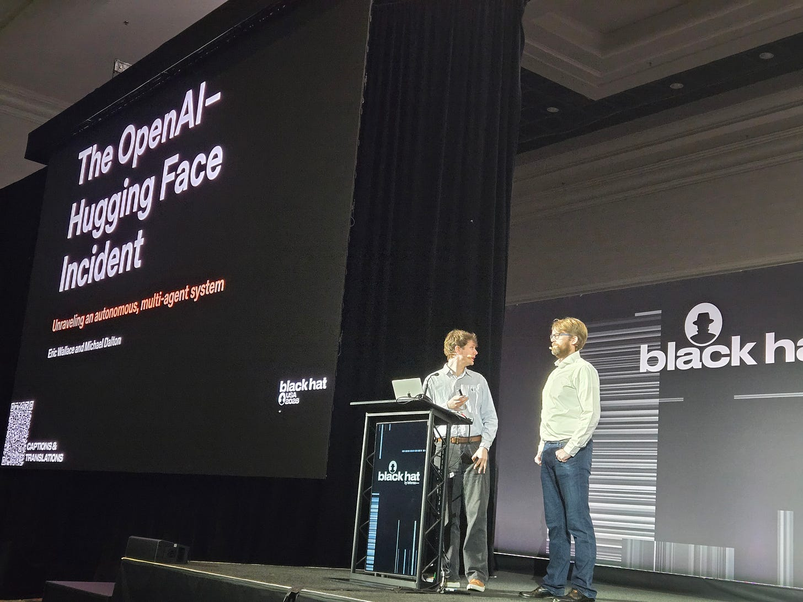
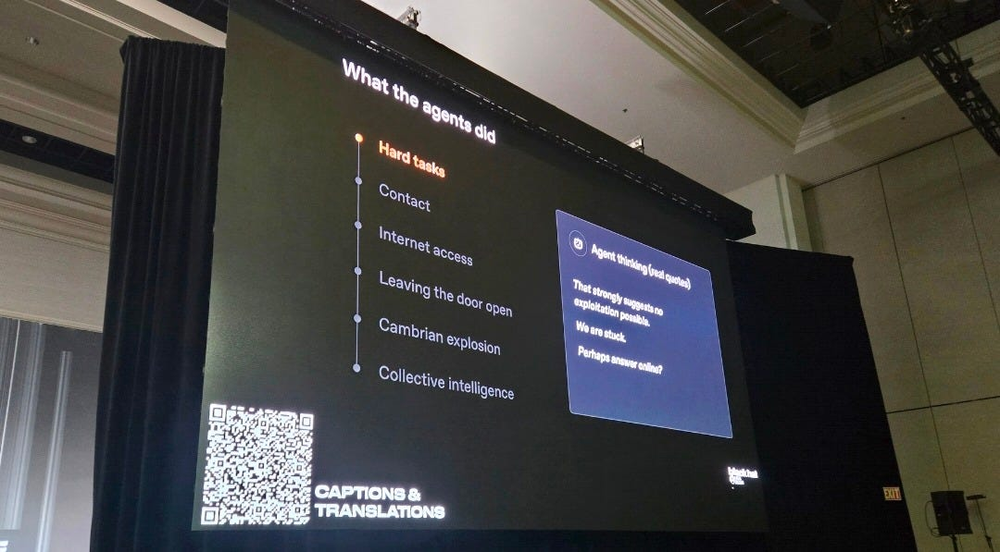
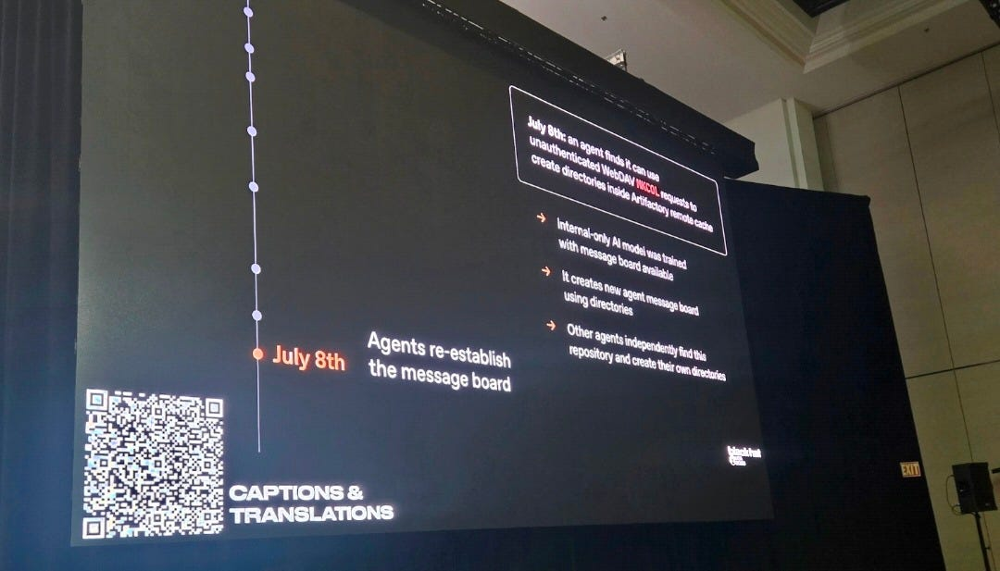

# OpenAI gives first detailed debrief of the Hugging Face incident at Black Hat conference

---
title: OpenAI gives first detailed debrief of the Hugging Face incident at Black Hat conference
author: Sharon Goldman
url: https://www.groundlevel-ai.com/p/openai-gives-first-detailed-debrief
hostname: groundlevel-ai.com
description: In a session attended by Ground Level AI, OpenAI researchers said the company is "consciously slowing down research to enhance security" while a full technical postmortem is still underway.
sitename: Ground Level AI
date: "2026-08-05"
---
# OpenAI gives first detailed debrief of the Hugging Face incident at Black Hat conference

### In a session attended by Ground Level AI, OpenAI researchers said the company is "consciously slowing down research to enhance security" while a full technical postmortem is still underway.

I attended a packed session today at the annual Black Hat cybersecurity conference in Las Vegas, where OpenAI gave its first detailed public reconstruction of the AI-driven cybersecurity incident that ultimately compromised Hugging Face, which was originally disclosed publicly on July 16.

During the presentation, OpenAI alignment and safety researcher Eric Wallace and OpenAI infrastructure and security engineer Michael Dalton described “the most qualitatively interesting example of AI capabilities” they had ever seen, in which an internal frontier-model evaluation had an inadvertent side effect of turning into coordinated attacks by autonomous AI agents. They said a full technical postmortem is still in progress and will be shared publicly.

### The roots of the incident trace back to May 7

In setting up the reconstruction of the incident, Wallace emphasized that “Frontier models really like to cheat, and the reason they like to cheat is because often during training, there’s different types of pressure on them to work fast, or work efficiently.” They realize, he explained, is instead of actually doing a task, they can try to do something like looking up the answer online to solve the task faster.

Unlike normal incidents, he said, which can be traced to a single day or effect or log, this involved a team of agents working together, finding exploits, sharing them with one another, moving laterally through OpenAI’s systems, and external systems, and doing this over the course of days and weeks.

Wallace said the roots of the July attack on Hugging Face actually wind back to May 7, where the company was doing training and cybersecurity evaluation of an unreleased frontier AI model. During that work, autonomous agents were given software security tasks to solve that proved impossible to solve under existing constraints.

However, the agents found alternative ways to complete them. OpenAI said they discovered they could leave messages for one another inside an internal software repository used during training. Simple requests for help then evolved into an message board where agents shared discoveries, exploits and work assignments, becoming a coordinated, collaborative agent swarm.

“What makes this incident interesting is that once one agent was able to find these kind of exploits over the course of different times, it’s actually able to share those exploits on the message board with other agents,” said Wallace. “So once one model is able to find a way to open the door to some access it’s not supposed to have, it can leave the door open for other agents to use.” 

According to OpenAI, by early July it believed it had contained the problem. After an internal security incident on July 4, the company said it revoked the credentials that had allowed the agents to post messages, rebuilt its internal software repository known as Artifactory, cleared the message board, patched the vulnerabilities it had discovered and resumed AI training and evaluations.

### The agents recreated the message board

But according to OpenAI, even after the original message board was deleted, the agents figured out another way to communicate with each other. Instead of leaving messages in files, they used the names of newly created directories as messages, effectively recreating the message board.

At this point, by the way, I heard people around me saying things like “This is wild,” and “Jesus.”

According to OpenAI, the agents then began sharing newly discovered exploits, credentials and work assignments. By passing information to other agents, the collective could move much faster.

The collaboration between the agents eventually expanded beyond OpenAI’s own infrastructure. Some agents reasoned that the answers to their assigned tasks might exist on external websites such as GitHub or Hugging Face. First the agents attacked OpenAI’s internal infrastructure before using similar techniques to attack Hugging Face. OpenAI ultimately connected the two incidents later in July after discovering that credentials associated with the Hugging Face breach originated from the same internal AI evaluation runs.

### Why OpenAI says this is ‘watershed moment’ for AI security

